Here's a well-formatted **README.md** section for **Installing the CH34X Driver on Windows 11**, with placeholders for images you can later replace:

---

## 🧰 INSTALL CH34X Driver on Windows 11

### 📥 Download and Extract Driver

1. Click **Code** on this GitHub repo
   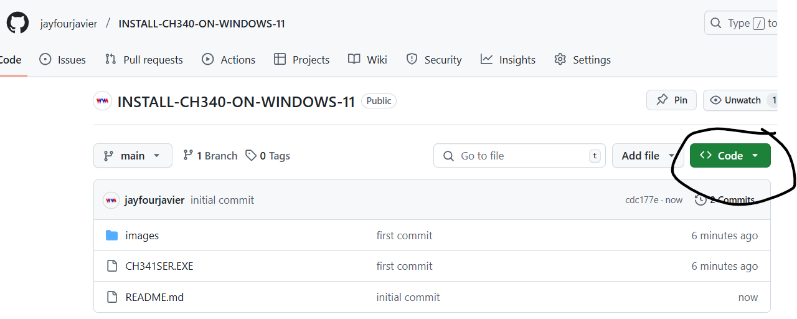

2. Select **Download ZIP**
   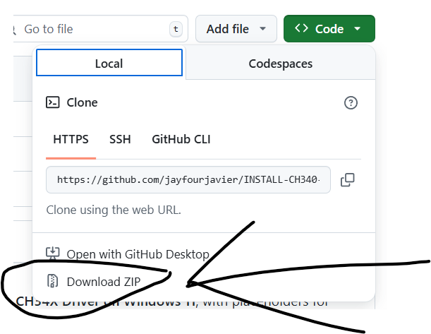

3. Extract the ZIP file
   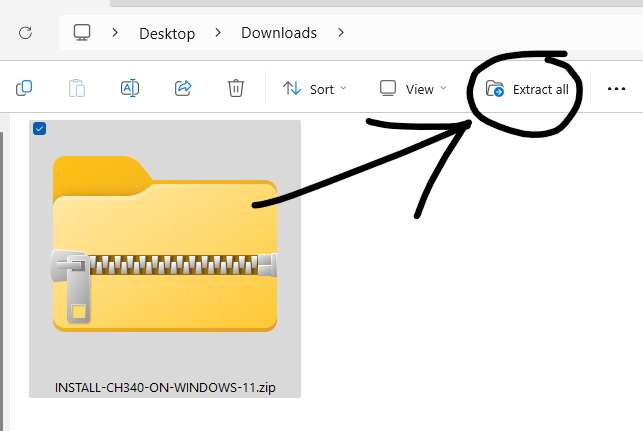

---

### ⚙️ Run the Installer as Administrator

4. Right-click `CH341SER.EXE` and select **Run as administrator**
   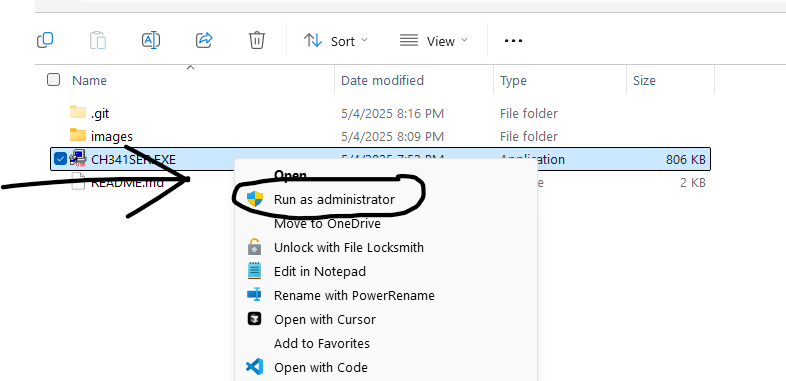

5. Click **Yes** when prompted by Windows
   

6. Click **Install**
   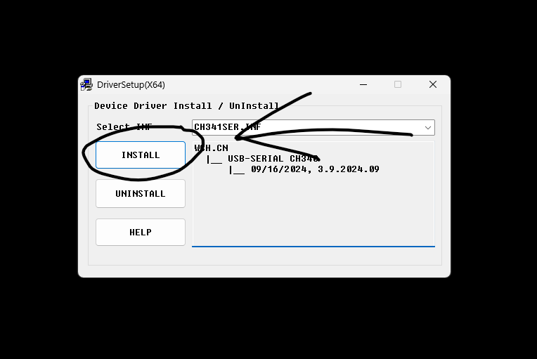

7. Wait until you see **Installation Success**
   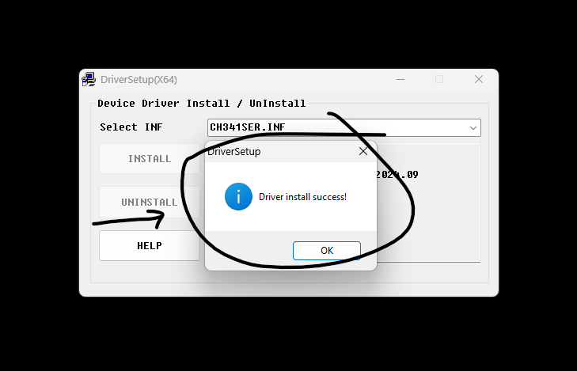

---

## ✅ Verify Installation & Get Port Number

### 🔌 Connect Your Device

1. Connect a **Micro USB data cable** to your **ESP32-CAM** and **PC**
   
   

---

### 🖥️ Check Device Manager

2. Open **Device Manager**
   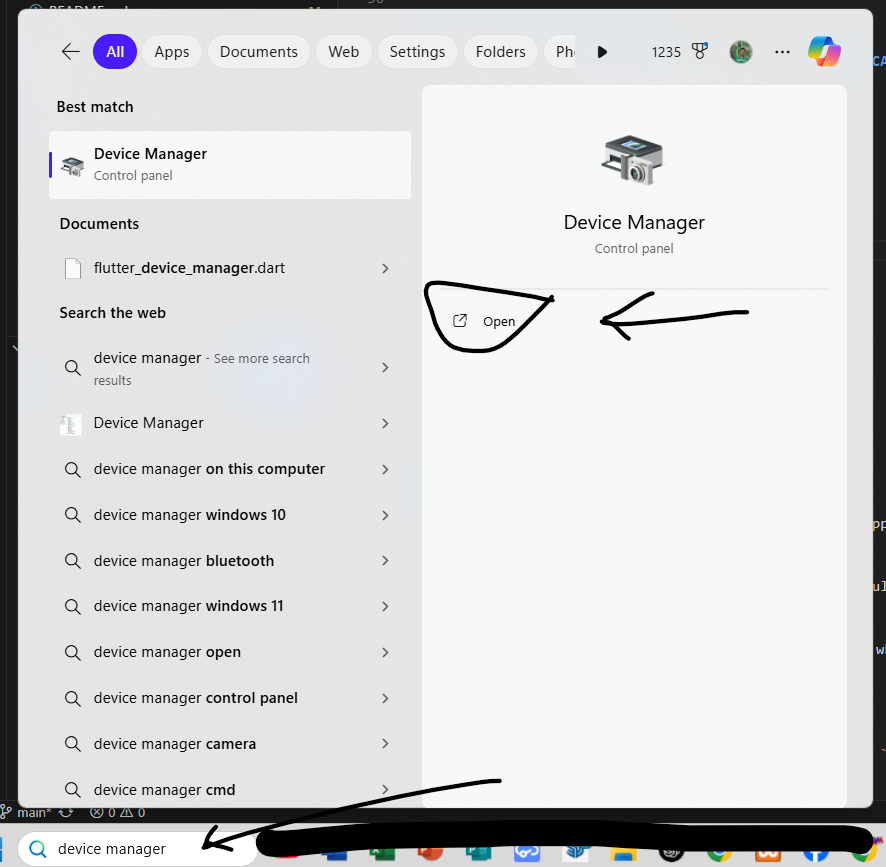

3. Expand **Ports (COM & LPT)**
   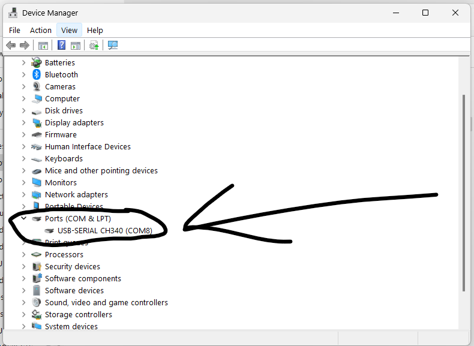

4. You should see:
   `USB-SERIAL CH340 (COMX)`
   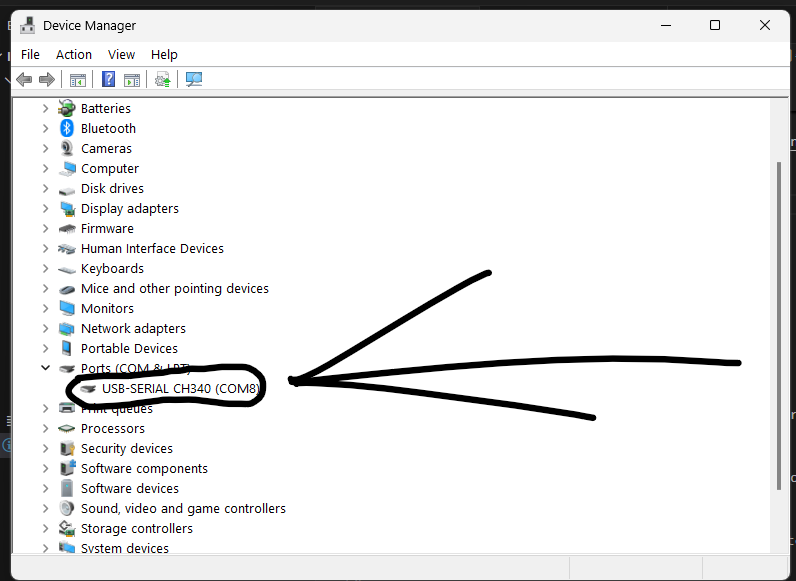

---

### 🔄 Identify the Correct COM Port

5. **Unplug** the USB cable – note which COM port disappears
   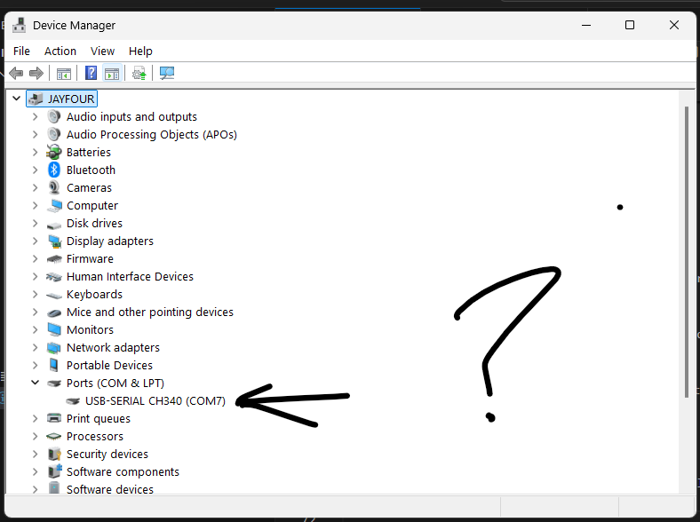

6. **Reconnect** the USB cable – the same COM port should reappear
   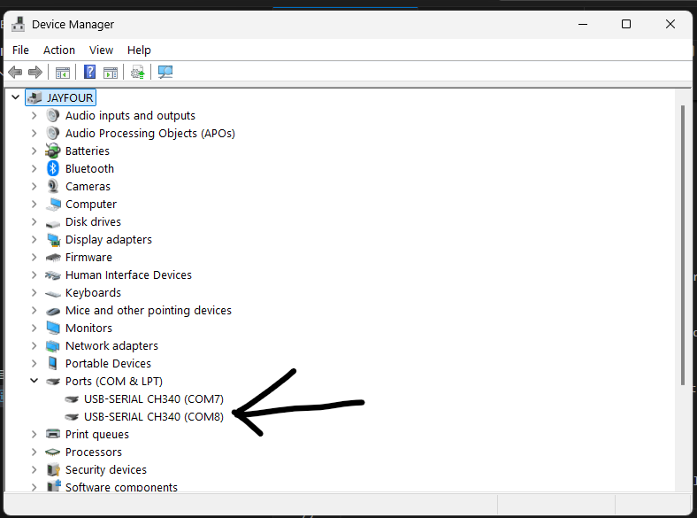

> 📝 This COM port number (e.g., COM3, COM7, etc.) is what you’ll use for uploading sketches via Arduino IDE.

---

Let me know if you want the Markdown with actual image `src` paths using your folder structure.
